# RAGFlow Integration — End-to-End Architecture & Implementation Plan

> Scope: how the bundled RAGFlow engine (`rag/`, v0.26.4) becomes the retrieval backbone for the objection-trained voice agent — architecture decisions, data flow, implementation phases, deployment, and verification.

> **Confirmed choices (2026-07-15):** (1) Persona = **prospect** first. (2) RAGFlow host = **cloud only for now** (console-tested; cloud hosting deferred). (3) First cut = **cards-only** — offline-built character cards as the prompt; live retrieval tool deferred to a later phase. (4) Embeddings = **HuggingFace model via RAGFlow's built-in TEI** (e.g. `bge-m3` / `Qwen/Qwen3-Embedding-0.6B`).

---

## 1. Context — why this change

`mission.md`: *"voice-only agent using existing call transcripts to create objection-trained characters."*

Today the pieces exist but are **not connected**:

| Asset | State |
|---|---|
| Voice agent (`src/agent.py`) | Works. STT Deepgram → LLM OpenRouter (`anthropic/claude-3-haiku`) → TTS Cartesia. Only long-term memory is **Mem0**. No RAG. |
| Persona (`prompts/agent-instructions.md`) | . Mission/docs want it to play the **objecting prospect**. References tools + a `rep_knowledge_base` that don't exist. |
| Raw corpus (`Agent-Vault/airtable-zoom-calls/`) | 847 transcript `.md` files + 24.7 MB Airtable export. Full base = 27,235 calls / 16,339 with text. |
| Extraction output (`data/*.json`) | 3 sample objection JSONs. `data/objections.json` is empty (0 bytes). |
| RAGFlow engine (`rag/`) | Full OSS clone, own git repo + cloud hosting. **Unwired** — no import, no client, no submodule. |
| Design docs (`docs/`) | Clear intent: transcripts → objections → clusters → character cards → prompt. RAG over raw transcripts declared *optional*. |

**Goal of this plan:** stand up a repeatable pipeline that turns transcripts into a RAGFlow-backed objection knowledge base, and give the voice agent a low-latency retrieval seam that pulls real customer phrasings — without breaking its latency budget.

---

## 2. Key architectural decisions

Each decision states the recommendation first, then the rationale and the trade-off you're accepting.

### D1 — RAGFlow runs as an external HTTP service; the agent uses `ragflow-sdk` only
**Decision:** The agent depends on the lightweight `ragflow-sdk` pip package and calls RAGFlow over HTTP (`:9380`). It never imports the vendored `rag/` tree. `rag/` is only ever run via its own Docker stack.

**Why:** The agent deploys as a LiveKit Cloud worker (`Dockerfile`, `uv sync --locked`). Pulling RAGFlow's Python deps (`elasticsearch-dsl`, `infinity-sdk`, `minio`, `valkey`…) into that image would bloat it and couple two very different lifecycles. RAGFlow is a server; treat it like one.

**Trade-off:** You must operate a second stack (§8) and keep it reachable from LiveKit Cloud.

### D2 — RAGFlow is primarily an *offline* knowledge engine; runtime RAG is optional and capped
**Decision:** Do the heavy work (ingest, chunk, embed, cluster, build character cards) **offline**. At runtime the agent loads a pre-built **character card as its system prompt** (zero retrieval latency). **First cut is cards-only** ✅ — the live, latency-guarded `@function_tool retrieve_phrasing()` is **deferred to a later phase** (Phase 6) once the offline pipeline and prospect persona are proven.

**Why:** `knowledge_base.md` says curated cards are more controllable and live RAG is optional. Voice is latency-sensitive (barge-in tuned to 0.3 s, `preemptive_generation=True`, OpenRouter `sort:latency`). Putting a vector search on the critical path of every turn would regress perceived responsiveness.

**Trade-off:** Cards can go stale; you re-generate them when new transcripts land (idempotent, keyed by record id).

### D3 — Honor the "embed only the quote" design using RAGFlow chunks + `meta_fields`
**Decision:** One objection turn = one RAGFlow **chunk** whose `content` is the verbatim `quote`. Everything else (`objection_type`, `intensity`, `rep_response_worked`, `cluster_id`, `role`, `transcript_id`, profile fields) is attached as **`meta_fields`** and filtered at query time via `metadata_condition`. This is exactly `what_get_embed.md`'s "filter first, then rank by similarity," expressed in RAGFlow terms.

**Why:** Embedding whole JSON blobs pollutes similarity (per `what_get_embed.md`). RAGFlow's `retrieve(question=…, metadata_condition=…)` gives filter-then-rank natively.

**Trade-off:** You bypass RAGFlow's deep-document/PDF chunking cleverness — but you don't need it; quotes are short structured text.

### D4 — Embedding model: HuggingFace model via RAGFlow's built-in TEI ✅ confirmed
**Decision:** Use a **HuggingFace embedding model served by RAGFlow's bundled TEI** service (`bge-m3` default, or `Qwen/Qwen3-Embedding-0.6B` — both already in `rag/docker/.env`). Keep `text-embedding-3-small` only as a documented fallback.

**Why:** Self-contained, no per-embedding OpenAI cost, and embeddings happen offline so TEI-on-CPU speed is fine. **All chunks in a dataset must share one embedding model** (RAGFlow constraint) — pick once per dataset.

**Trade-off:** TEI-CPU is slower to bulk-embed than a hosted API; acceptable offline.

### D5 — Two datasets keyed by role, not one
**Decision:** Create two RAGFlow datasets: `objections` (role=customer quotes — feeds the prospect persona) and `rep_lines` (role=rep, `rep_response_worked=yes` — feeds a future rep-coach persona). Matches `voice_ai_design.md`'s collections.

**Why:** Cleaner filtering, independent re-embedding, and it lets you ship either persona (D6) without cross-contamination.

**Trade-off:** Two ingestion passes; negligible cost.

### D6 — Persona = prospect, first ✅ confirmed (gated by TDD)
**Decision:** Ship the **prospect** persona first (mission-aligned). The agent role-plays the objecting customer, loaded from a character card; reps practice handling it. The rep-coach persona (D5's `rep_lines`) is a later, separate track. Because this changes core agent behavior, `AGENTS.md` mandates **TDD**: write behavior tests first (mirroring `tests/test_agent.py`'s LLM-judge pattern), then change the prompt.

**Why:** RAG only has meaning once we know whose knowledge we're retrieving (customer objections vs. winning rebuttals).

**Trade-off:** Touching the persona is a behavior change with its own test surface; keep it a separate, reviewable step from the RAG plumbing.

### D7 (honest fit note) — RAGFlow is heavier than this retrieval task strictly needs
For "embed short quotes + filter on metadata + top-k," a single pgvector table or Qdrant collection would be lighter. You've already vendored RAGFlow, so this plan commits to it and uses it well — but if operating the multi-service stack becomes a burden, the **entire runtime seam (D2/D3) is one `retrieve()` call** and can be repointed at pgvector/Qdrant with an unchanged agent interface. Design the retrieval tool behind a thin `Retriever` protocol so the backend is swappable.

---

## 3. Target architecture

```mermaid
flowchart TD
    subgraph Offline["OFFLINE — build-time pipeline (run with uv, not on the call path)"]
        A[Agent-Vault/airtable-zoom-calls/*.md<br/>847 transcripts] --> B[extract.py<br/>batched LLM pass]
        B --> C[data/objections/*.json<br/>structured, keyed by record id]
        C --> D[cluster.py<br/>6-10 objection clusters]
        D --> E[cards.py<br/>5-8 character cards<br/>prompts/characters/*.md]
        C --> F[ingest_ragflow.py<br/>quote -> chunk + meta_fields]
    end

    subgraph RAGFlow["RAGFlow SERVER (Docker stack, :9380)"]
        F --> G[(dataset: objections)]
        F --> H[(dataset: rep_lines)]
        TEI[TEI embeddings<br/>bge-m3 / Qwen3] --- G
        TEI --- H
    end

    subgraph Online["ONLINE — LiveKit Cloud worker (src/agent.py)"]
        E -. loaded as system prompt .-> P[Assistant persona = one character card]
        P --> S[AgentSession<br/>Deepgram -> OpenRouter LLM -> Cartesia]
        S -. optional, capped .-> T["@function_tool retrieve_phrasing()"]
        T -->|ragflow-sdk HTTP<br/>metadata_condition + question| G
        M[Mem0 recall] -. initial_ctx .-> P
    end
```



**Boundary that matters:** the only line crossing from the agent into RAGFlow is `ragflow-sdk` → `:9380`. Nothing else.

---

## 4. Data model — what a chunk looks like

One objection turn → one chunk in the `objections` dataset:

```python
# content = ONLY the verbatim quote (this is what gets embedded)
content = "That's more than I paid for my last agency, and that was a waste."

# meta_fields = everything else (filtered, never embedded)
meta_fields = {
    "transcript_id": "2026-05-18-stephanie-franken-nick-rec1u23WGXAIiuMAj",
    "role": "customer",
    "objection_type": "price",          # price | timing | trust | authority | time_commitment | ...
    "intensity": "high",                 # low | medium | high
    "rep_response_worked": "yes",        # yes | no | unknown
    "customer_age_range": "40-50",
    "business_type": "auto body shop",
    "cluster_id": "burned_before_skeptic",
}
```

Source schema is already defined by `data/*.json` (`objections_raised[].{type,quote,intensity,rep_response_worked,context}` + `customer_profile` + `tone_and_style`). The ingestion script maps that schema → chunk content + `meta_fields`. `rep_lines` mirrors this with `role=rep` and the winning rebuttal as content.

---

## 5. End-to-end flow

### 5a. Offline pipeline (new `scripts/` dir, run via `uv run`)
1. **Extract** — `scripts/extract.py`: iterate `Agent-Vault/airtable-zoom-calls/*.md`, one batched LLM pass per transcript, emit `data/objections/<record_id>.json` using the existing sample schema. Idempotent: skip a record id whose output already exists. (Extends the 3 existing samples to all 847.)
2. **Cluster** — `scripts/cluster.py`: aggregate all objection JSONs, cluster into 6–10 types ranked by frequency + correlation with lost deals; write `cluster_id` back and aggregate into `data/objections.json` (currently empty).
3. **Cards** — `scripts/cards.py`: build 5–8 `prompts/characters/<cluster>.md` cards (persona + top 3–4 objections with real quotes + escalation behavior). These become selectable agent system prompts.
4. **Ingest** — `scripts/ingest_ragflow.py`: create/lookup the `objections` and `rep_lines` datasets, upload each quote as a chunk with `meta_fields`, then parse/embed. Idempotent via a stored `transcript_id`+quote hash.

### 5b. Online retrieval (agent change)
- `Assistant.__init__` loads a chosen character card (env/room-metadata selectable) as `instructions` — replaces the static rep prompt for the prospect persona.
- New `@function_tool retrieve_phrasing(objection_type, situation)` on `Assistant`:
  - Calls `rag.retrieve(dataset_ids=[objections_id], question=situation, metadata_condition={objection_type, cluster_id, ...}, page_size=3, similarity_threshold≈0.2, keyword=False)`.
  - Returns up to 3 verbatim quotes for the LLM to voice naturally.
  - **Latency guards:** `top_k` modest, rerank OFF by default, `asyncio.wait_for(...)` timeout (~250 ms) with graceful empty fallback (never block the turn), and an in-process/Redis semantic cache keyed by (objection_type, cluster_id, normalized situation).
- Retrieval client is created behind a thin `Retriever` protocol (D7) so the backend is swappable.

---

## 6. Implementation phases

Each phase is independently shippable, reviewed (`code-reviewer`), and — where it touches agent behavior — TDD-first per `AGENTS.md`.

| Phase | Deliverable | Key files | Tests |
|---|---|---|---|
| **0. Secrets hygiene** (do first) | Rotate exposed keys; confirm `.env.local` gitignored; add RAGFlow keys to `.env.example` | `.gitignore`, `.env.example` | n/a |
| **1. RAGFlow stack up** | RAGFlow running locally + reachable; API key minted; `objections`/`rep_lines` datasets created | `rag/docker/` (compose), `.env.example` | manual `retrieve` smoke test |
| **2. Ingestion** | Quotes → chunks + meta_fields; embedded | `scripts/ingest_ragflow.py` | unit: schema→chunk mapping; integration: upload+retrieve roundtrip |
| **3. Extraction at scale** | All 847 transcripts → `data/objections/*.json` | `scripts/extract.py` | unit: parser on a fixture transcript |
| **4. Clustering + cards** | `data/objections.json`, `prompts/characters/*.md` | `scripts/cluster.py`, `scripts/cards.py` | unit: cluster assignment; snapshot: card shape |
| **5. Persona switch (prospect)** ← **first-cut finish line** | Agent loads a character card; behaves as objecting prospect (cards-only, no runtime RAG yet) | `prompts/characters/*`, `src/agent.py` (`Assistant`) | **TDD**: LLM-judge tests "raises price objection", "stays in character" |
| **6. Runtime retrieval tool** *(deferred)* | `retrieve_phrasing` tool wired, capped, cached | `src/agent.py`, new `src/retrieval.py` (`Retriever` protocol) | unit: tool builds correct `metadata_condition`, timeout fallback returns empty |
| **7. Post-call scorer (optional)** | Score which objections the rep resolved | `src/agent.py` shutdown hook | unit on scoring logic |

> **First cut = Phases 0–5.** Phase 2 (ingestion) still runs so the datasets exist and are verifiable, but the *agent* doesn't query them live until Phase 6. Cards are the runtime knowledge; RAGFlow is the offline store that produced them.

Reuse the existing injection seams: Mem0's `initial_ctx.add_message(...)` pattern (`src/agent.py:291-307`) and the commented `@function_tool` stub (`src/agent.py:151-163`) show exactly where card context and the retrieval tool attach.

---

## 7. RAGFlow API reference (verified against v0.26.x SDK)

```python
from ragflow_sdk import RAGFlow

rag = RAGFlow(api_key=os.environ["RAGFLOW_API_KEY"],
              base_url=os.environ["RAGFLOW_BASE_URL"])   # e.g. http://host:9380

# --- ingest (offline) ---
ds = rag.create_dataset(name="objections")               # or list_datasets(name=...)
docs = ds.upload_documents([{"display_name": f"{rid}.txt", "blob": b""}])
docs[0].add_chunk(content=quote, meta_fields={...})       # embed ONLY the quote

# --- retrieve (online, capped) ---
for c in rag.retrieve(
        dataset_ids=[ds.id],
        question=situation,
        metadata_condition={"objection_type": "price", "cluster_id": "..."},
        page_size=3, similarity_threshold=0.2,
        vector_similarity_weight=0.3, keyword=False):
    use(c.content)   # verbatim quote
```

Dataset creation also accepts `embedding_model`, `chunk_method`, `parser_config` (`POST /api/v1/datasets`). Confirm exact `meta_fields` / `metadata_condition` operators against your pinned build (`rag/docs/references/{python,http}_api_reference.md`) during Phase 2.

---

## 8. Deployment & configuration

- **RAGFlow stack (local dev for now ✅):** run from `rag/docker/` (`docker compose up -d`, default `DOC_ENGINE=elasticsearch`; TEI embeddings on CPU). Services: ES/Infinity, MySQL, MinIO, Redis/Valkey, RAGFlow API `:9380`, TEI `:6380`. The agent is console-tested against `http://localhost:9380`; no cloud exposure needed at this stage.
- **Reachability (deferred until deploy):** when the agent later runs on **LiveKit Cloud**, RAGFlow must be reachable from there — host it on a small cloud VM with the API port protected (API key + IP allowlist / private networking / tunnel) and change the default `infini_rag_flow` passwords (`rag/docker/.env` + `rag/conf/service_conf.yaml`). Not required for the local-dev first cut.
- **New env keys** (add to `.env.example`, load in `src/agent.py`):
  - `RAGFLOW_BASE_URL`, `RAGFLOW_API_KEY`, `RAGFLOW_OBJECTIONS_DATASET_ID`, `RAGFLOW_REP_LINES_DATASET_ID`, `RAGFLOW_ENABLED` (feature flag → fail-open like Mem0).
- **Dependency:** add `ragflow-sdk` to `pyproject.toml` runtime deps; `uv sync`. Do not add RAGFlow server deps.
- **Fail-open:** mirror `init_memory()` — if RAGFlow is unreachable, log and continue; the card-based persona still works without live retrieval.

---

## 9. Security (address before any commit)

- **Exposed secrets:** `.env.local` reportedly holds **real** LiveKit/OpenRouter/Deepgram/Cartesia/Mem0 values in the working tree. Confirm it's gitignored, and **rotate** any key that has ever been committed (check `git log`). This is Phase 0 and blocks everything else.
- **PII:** `Agent-Vault/` transcripts contain names, emails, Zoom links. Keep the raw folder immutable + gitignored (per `knowledge_base.md`). Chunks store verbatim quotes — treat the RAGFlow store as PII-bearing (access control, no public exposure).
- **Prompt-injection:** transcripts are untrusted text. The persona prompt already has injection-resistance rules; keep retrieved quotes as *data to voice*, never as instructions.
- **RAGFlow defaults:** change default passwords; restrict `:9380` network exposure.

---

## 10. Verification (end-to-end)

1. **Ingestion roundtrip:** run `ingest_ragflow.py` on the 3 existing `data/*.json`; assert `retrieve(question="too expensive", metadata_condition={"objection_type":"price"})` returns the seeded price quote. (integration test)
2. **Metadata filtering:** query with `rep_response_worked="yes"` and confirm only winning turns come back.
3. **Persona behavior (TDD):** `uv run pytest` — LLM-judge tests confirm the agent raises an objection in character and resists until handled (extends `tests/test_agent.py`).
4. **Tool + latency:** unit-test `retrieve_phrasing` builds the right `metadata_condition` and that a simulated slow RAGFlow trips the timeout and returns empty without blocking.
5. **Live console call:** `uv run src/agent.py console` — talk to the prospect persona, trigger an objection, confirm it voices a realistic quote and that a RAGFlow outage doesn't drop the call.
6. **Formatting/lint:** `uv run ruff format && uv run ruff check`.

---

## 11. Decisions — resolved & remaining

**Resolved (2026-07-15):**
1. Persona to ship first → **prospect**.
2. Where RAGFlow runs → **local dev only** for now (cloud VM deferred to deploy time).
3. Runtime RAG → **cards-only first**; live `retrieve_phrasing` tool deferred to Phase 6.
4. Embedding model → **HuggingFace model via built-in TEI** (`bge-m3` / `Qwen3-Embedding`).

**Still to decide (before Phase 3 extraction):**
5. **Extraction LLM + budget/rate** for the 847-transcript (eventually 16k) batched pass — model choice and how much to spend. Can start with the 3 existing samples + a small batch to validate the schema, then scale.
